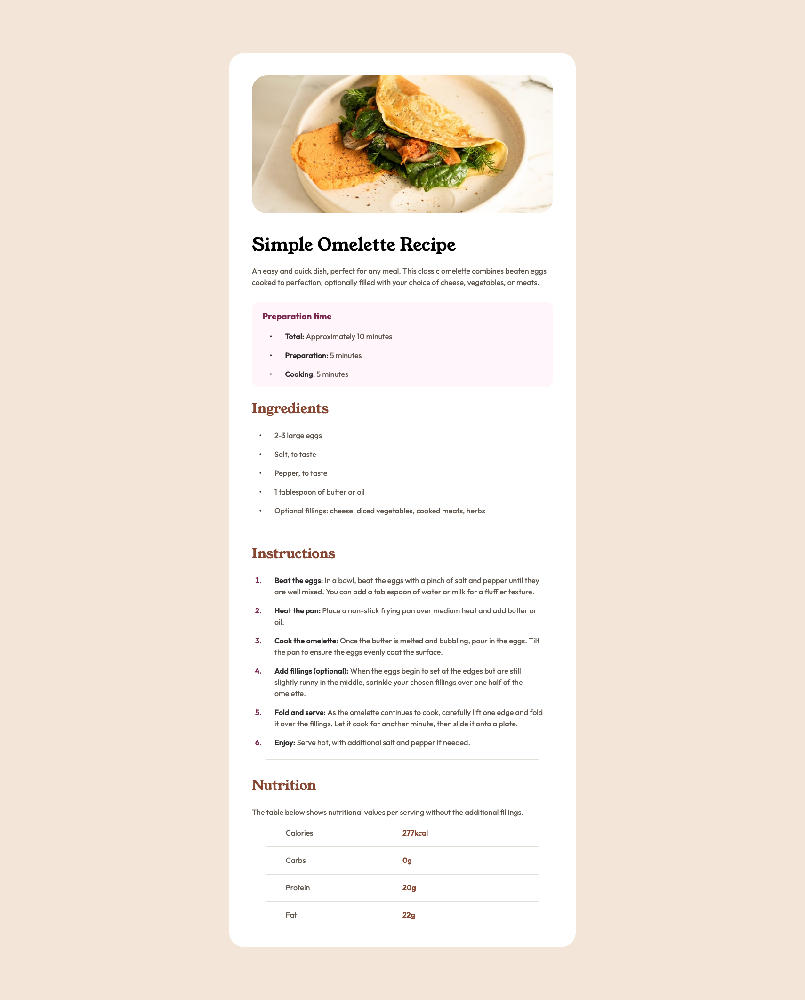
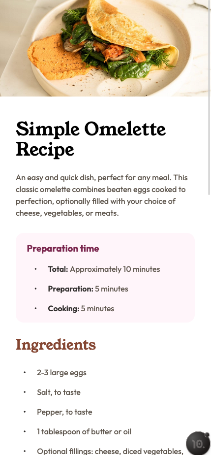

# Frontend Mentor - Recipe page solution

This is a solution to the [Recipe page challenge on Frontend Mentor](https://www.frontendmentor.io/challenges/recipe-page-KiTsR8QQKm). Frontend Mentor challenges help you improve your coding skills by building realistic projects.

## Table of contents

- [Overview](#overview)
  - [The challenge](#the-challenge)
  - [Screenshot](#screenshot)
  - [Links](#links)
- [My process](#my-process)
  - [Built with](#built-with)
  - [What I learned](#what-i-learned)
- [Author](#author)

## Overview

### Screenshot




### Links

- Solution URL: [Add solution URL here](https://your-solution-url.com)
- Live Site URL: [Add live site URL here](https://your-live-site-url.com)

## My process

### Built with

- Semantic HTML5 markup
- CSS custom properties
- Flexbox
- Mobile-first workflow

### What I learned

I'm glad I was able to figure out how to keep the margin between the white box containing the recipe and the edges of the viewport even when shrinking the window. I did this by creating the class desktop-card within the media query and setting a max-width and min-width.

```css
.desktop-card {
  background-color: var(--white);
  max-width: 40rem;
  min-width: calc(100% - 15rem);
  border-radius: 2rem;
  margin: 4rem;
  padding: 3rem;
}
```

## Author

- Frontend Mentor - [@teuthix](https://www.frontendmentor.io/profile/teuthix)
